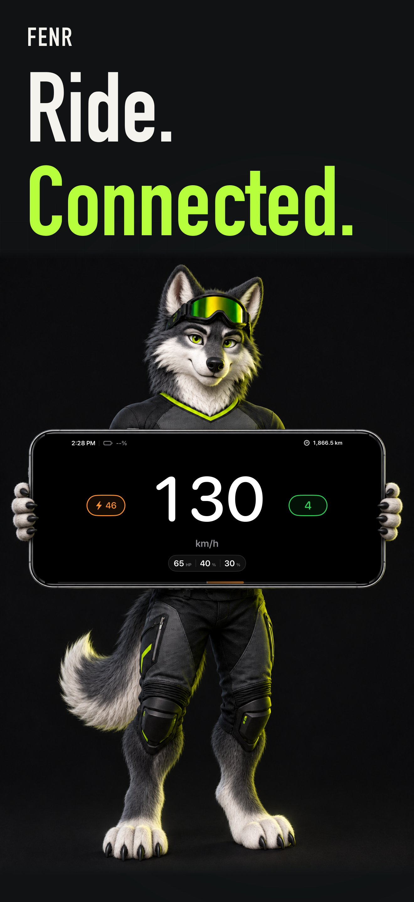
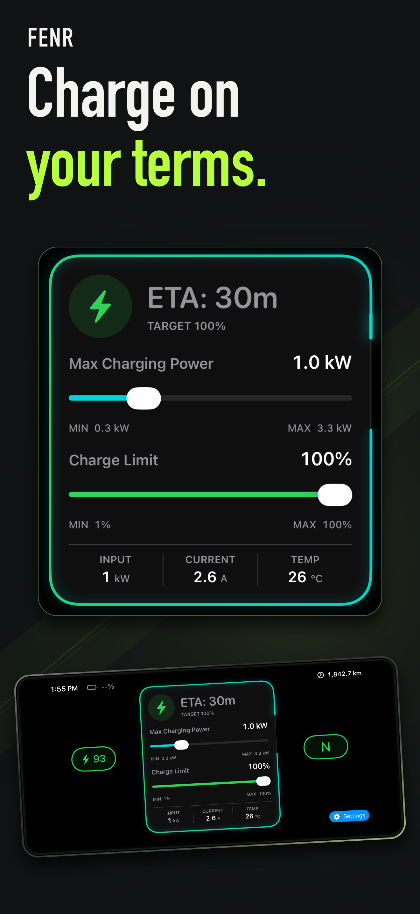
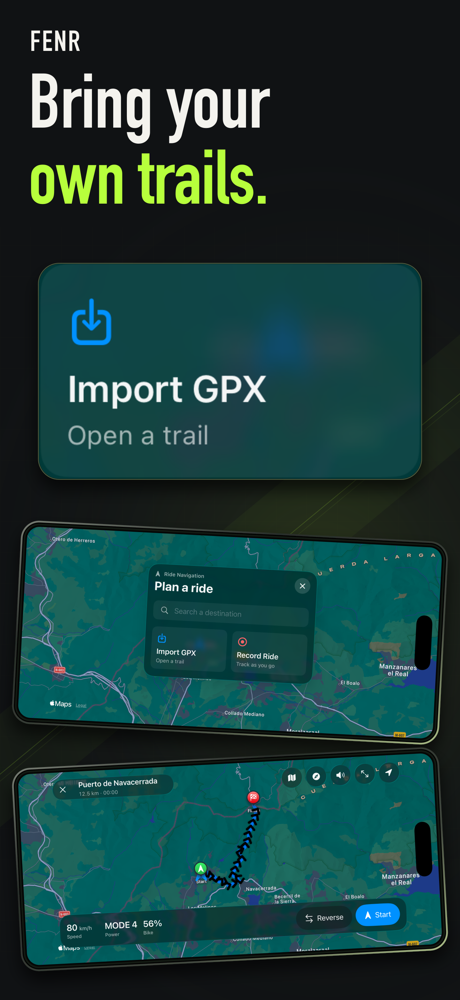

<p align="center">
  
</p>

<h1 align="center">FENR</h1>
<p align="center">Your motorcycle, at a glance.</p>

FENR is an open-source iPhone app for compatible electric motorcycles, with a live riding dashboard, charging controls, battery insights and ride navigation. Explore the built-in demo without a motorcycle or account: **Explore demo > Start demo**.

FENR is independent and unofficial. It is not affiliated with or endorsed by Stark Future or any vehicle manufacturer.

<p align="center">
  
  
  
</p>

## Features

- Live Bluetooth dashboard with speed, battery, riding mode, indicators and customizable cards.
- Charging progress, power and charge-target controls, including Live Activities.
- Battery health, cell voltages and diagnostic history.
- Power, regenerative braking, traction and bike-lock controls where supported by the motorcycle and firmware.
- Route planning, ride recording, GPX import/export and destination sharing.
- Ride history, maintenance records and measurement-unit preferences.

Diagnostic capture starts only when you select **Start** in Diagnostics and ends with **Stop**. It begins disabled on every app launch. Saved logs can be reviewed, exported or deleted.

The first release is for iPhone. A separate, telemetry-only Apple Watch app remains in the repository for future distribution.

## Getting started

The iPhone app targets **iOS 17 or later**. Liquid Glass is used on **iOS 26 or later**, with standard materials and controls on earlier versions. The separate Watch app targets watchOS 10 or later.

Build with **Xcode 26 or later** for the SwiftUI APIs and generated String Catalog symbols. See [Development](docs/development.md) for setup and [Testing](docs/testing.md) for validation commands.

```sh
brew install xcodegen swiftlint
if [ -x .xcodegen/generate-local.sh ]; then
  .xcodegen/generate-local.sh
else
  xcodegen generate
fi
open FENR.xcodeproj
```

Select **FENR** for the main app, including its built-in demo, or **FENRDebug** for the development emulator. Configure your own signing team when running on a physical device.

For a real motorcycle, disconnect other Bluetooth clients, including the Arkenstone phone, before pairing. The observed VCU accepts one active client. Available telemetry and controls depend on the motorcycle and firmware; the demo simulates vehicle responses.

## Documentation

- [Development](docs/development.md) and [architecture](docs/architecture.md)
- [Testing](docs/testing.md), [localization](docs/localization.md) and [demo walkthrough](docs/app-review-demo.md)
- [App Store materials](store/README.md)
- [Protocol research](https://github.com/fenrapp/bike-protocol-research)

## Contributing

Read [Contributing](CONTRIBUTING.md) and the [Code of Conduct](CODE_OF_CONDUCT.md). Report security concerns through [Security](SECURITY.md).

FENR is released under the [MIT License](LICENSE).
